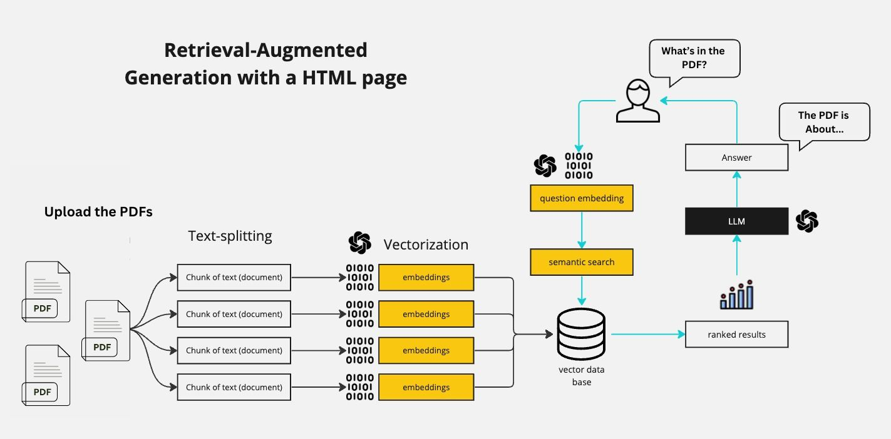

# Chat with PDFs

## Features
- **PDF Interaction**: The chatbot uses the latest version of LangChain to interact with and extract information from various PDFs.
- **Large Language Model Integration**: Compatibility with models like GPT-4, Mistral, Llama2, and ollama. In this code I am using Mistral, but you can change it to any other model.
- **Streamlit GUI**: A clean and intuitive user interface built with Streamlit, making it accessible for users with varying levels of technical expertise.
- **Python-based**: Entirely coded in Python.

## Brief explanation of how RAG works

A RAG bot is short for Retrieval-Augmented Generation. This means that we are going to "augment" the knowledge of our LLM with new information that we are going to pass in our prompt. We first vectorize all the text that we want to use as "augmented knowledge" and then look through the vectorized text to find the most similar text to our prompt. We then pass this text to our LLM as a prefix.



## Installation
Ensure you have Python installed on your system. Then clone this repository:

```bash
git clone [repository-link]
cd [repository-directory]
```

Install the required packages:

```bash
pip install -r requirements.txt
```

## Run
To run the Streamlit app:

```bash
streamlit run app.py
```
## Additional Note
To test the program is running fine, I have made a CLI based questions answering also, to use that:

```bash
command 1: python create_database.py
command 2: python query_data.py "pass your question here"
```
